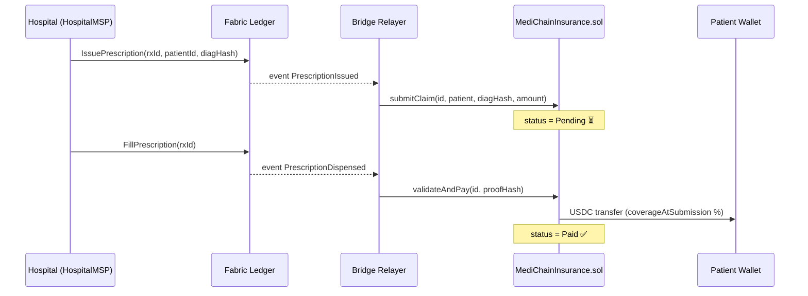
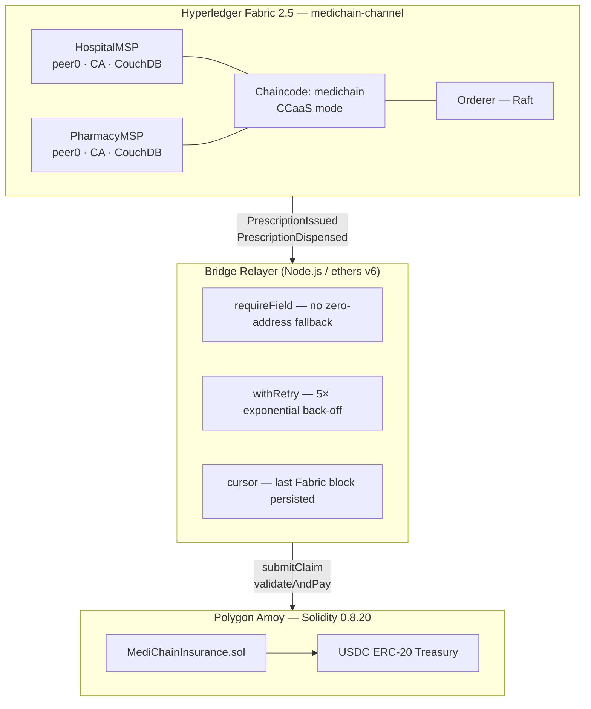
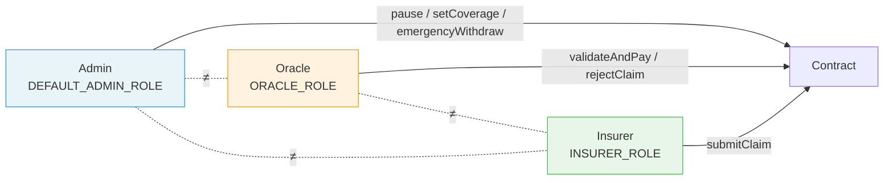
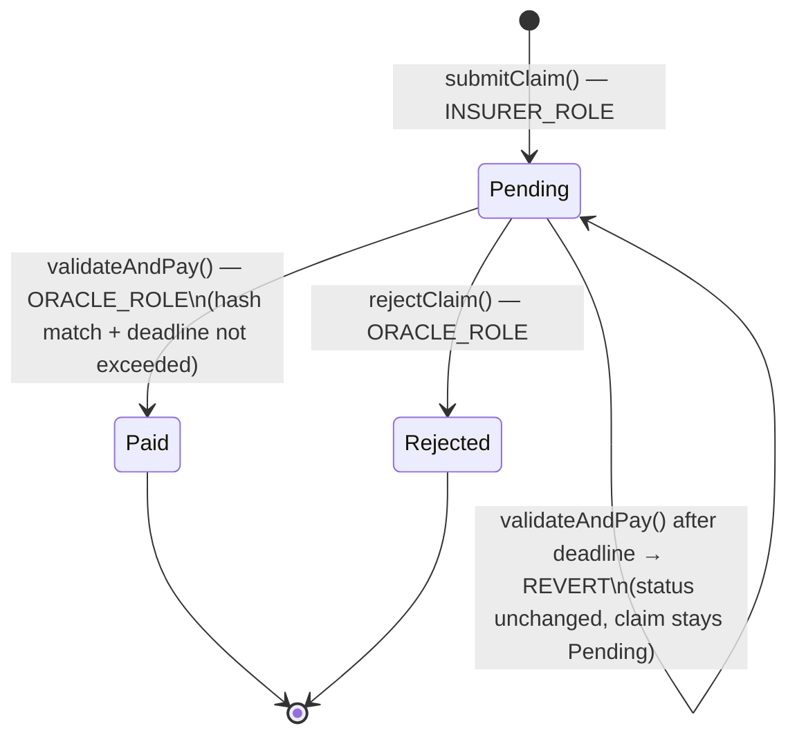
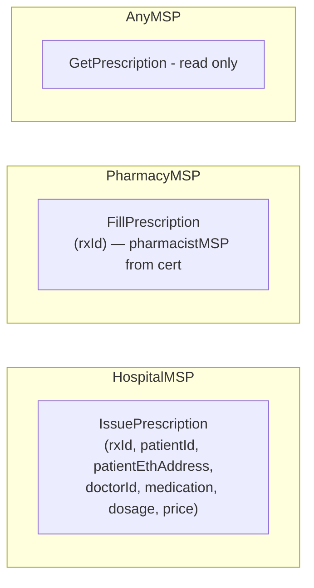
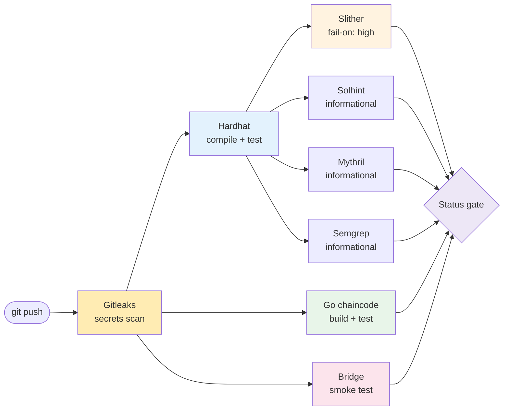
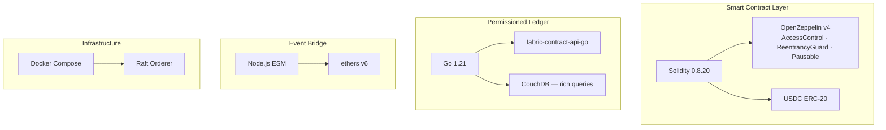
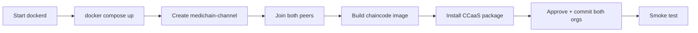
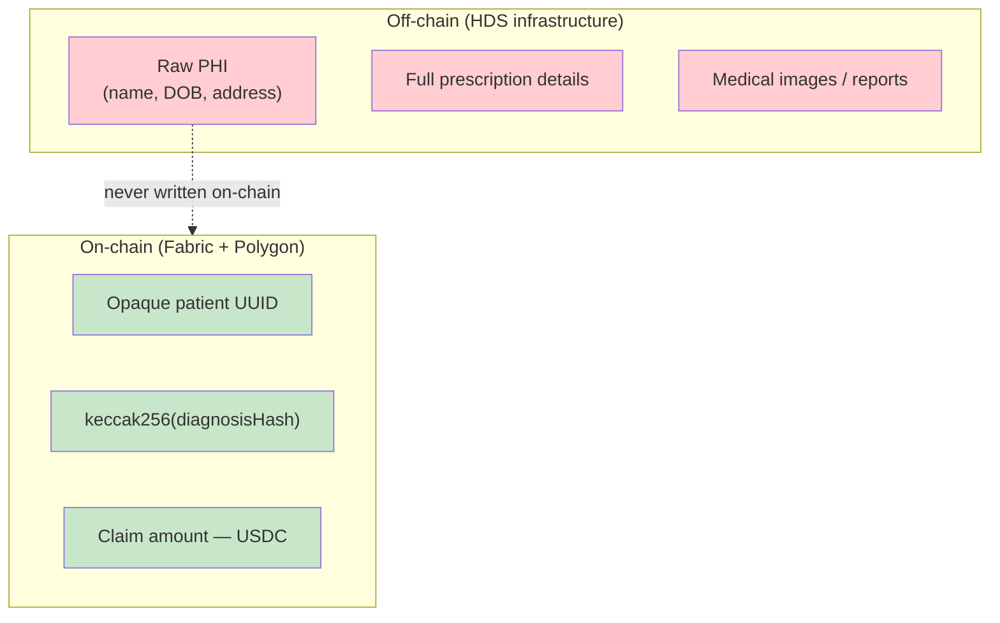

<div align="center">

# MediChain+

**Parametric micro-insurance for pharmaceutical prescriptions**

Automated USDC disbursement the moment a prescription is dispensed —
no manual adjudication, no delays.

[](https://github.com/omarbabba779xx/Medichain-plus/actions/workflows/ci.yml)
[](contracts/MediChainInsurance.sol)
[](fabric-network/)
[](https://amoy.polygonscan.com)
[](LICENSE)

</div>

---

## How It Works

A prescription travels from hospital to pharmacy on a private Fabric ledger.
The moment it is dispensed, a Node.js bridge relayer translates the Fabric event
into a Solidity transaction — the patient's USDC lands in seconds.



---

## Architecture



---

## Security Model

### Role Separation



> Enforced in the constructor — deploying with overlapping roles reverts immediately.

### Claim State Machine



### Chaincode Access Control



---

## Security Audit

All **19 findings** from the internal audit have been remediated.

| ID | Finding | Severity | Status |
|---|---|---|---|
| C-01 | Oracle/insurer role confusion in constructor | Critical | ✅ Fixed |
| C-02 | `emergencyWithdraw` missing reentrancy guard + bounds check | Critical | ✅ Fixed |
| C-03 | MSP access control absent in chaincode | Critical | ✅ Fixed |
| C-04 | `time.Now()` non-determinism across Fabric peers | Critical | ✅ Fixed |
| C-05 | `float64` monetary amounts (consensus non-determinism) | Critical | ✅ Fixed |
| C-06 | Bridge relayer silent fallback to zero-address | Critical | ✅ Fixed |
| H-01 | Claim expiry not enforced in `validateAndPay` | High | ✅ Fixed |
| H-02 | Coverage % changeable after claim submission | High | ✅ Fixed |
| H-03 | No retry logic in bridge relayer | High | ✅ Fixed |
| H-04 | No persistent event cursor in bridge relayer | High | ✅ Fixed |
| H-05 | `setMaxClaimAmount` missing validation | High | ✅ Fixed |
| H-06 | Missing `emergencyWithdraw` tests | High | ✅ Fixed |
| H-07 | Slither `continue-on-error` silencing high findings | High | ✅ Fixed |
| M-01 | MSP constant mismatch (`Org1MSP` vs `HospitalMSP`) | Medium | ✅ Fixed |
| M-02 | Missing `rejectClaim` tests | Medium | ✅ Fixed |
| M-03 | Gitleaks secrets scanning absent from CI | Medium | ✅ Fixed |
| M-04 | DPIA missing | Medium | ✅ Fixed |
| L-01 | `deployment.json` not in `.gitignore` | Low | ✅ Fixed |
| L-02 | CouchDB credentials hardcoded in docker-compose | Low | ✅ Fixed |
| L-03 | Native token lockup (missing receive/fallback revert) | Low | ✅ Fixed |

---

## CI/CD Pipeline



| Job | Tool | Blocks merge |
|---|---|---|
| Secrets | Gitleaks CLI 8.x | Yes |
| Compile + test | Hardhat | Yes |
| Static analysis | Slither `fail-on: high` | Yes |
| Go build + test | `go test -race` | Yes |
| Bridge smoke | `relayer.js --mode=mock` | Yes |
| Style lint | Solhint | No |
| Symbolic exec | Mythril | No |
| SAST | Semgrep | No |

---

## Technology Stack



---

## Repository Structure

```
Medichain-plus/
├── contracts/
│   ├── MediChainInsurance.sol     Solidity — USDC treasury + payout logic
│   └── MockERC20.sol              Test-only mock stablecoin
├── chaincode/
│   ├── medichain/
│   │   ├── medichain.go           Fabric chaincode — prescription lifecycle
│   │   ├── Dockerfile             Multi-stage Go build (CCaaS)
│   │   └── go.mod
│   ├── medical_records.go         Fabric chaincode — records + consent
│   ├── medical_records_test.go
│   └── go.mod
├── bridge/
│   ├── relayer.js                 Node.js bridge — Fabric → Polygon
│   ├── package.json
│   └── fixtures/
│       └── events.jsonl           Mock events for CI / local demo
├── fabric-network/
│   ├── docker-compose.yaml        2-org network (HospitalMSP + PharmacyMSP)
│   ├── configtx.yaml
│   ├── crypto-config/             MSP certificates
│   ├── channel-artifacts/
│   └── scripts/
│       └── deploy-ccaas.sh        One-shot deployment script
├── test/
│   └── MediChainInsurance.test.js Hardhat tests — unit + security
├── docs/
│   ├── DPIA.md                    GDPR Art. 35 impact assessment
│   └── HDS/                       French HDS compliance docs
├── .github/workflows/ci.yml       Full CI pipeline
├── hardhat.config.js
├── slither.config.json
└── .semgrep.yml
```

---

## Prerequisites

| Tool | Version |
|---|---|
| Docker + Docker Compose | 24+ |
| Go | 1.21+ |
| Node.js | 20+ |
| Hyperledger Fabric binaries | 2.5.6 (auto-downloaded) |

---

## Getting Started

### 1. Clone

```bash
git clone https://github.com/omarbabba779xx/Medichain-plus.git
cd Medichain-plus
```

### 2. Install dependencies

```bash
npm install
cd bridge && npm install && cd ..
```

### 3. Run Solidity tests

```bash
npx hardhat test
npx hardhat coverage    # generates coverage/index.html
```

### 4. Deploy the Fabric network (WSL2 / Linux)

```bash
bash fabric-network/scripts/deploy-ccaas.sh
```

This script:



### 5. Deploy the Solidity contract (Polygon Amoy)

```bash
cp .env.example .env
# set PRIVATE_KEY and AMOY_RPC in .env
npx hardhat run scripts/deploy.js --network amoy
```

Contract address saved to `deployment.json` (git-ignored).

### 6. Run the bridge relayer

```bash
# Mock mode (no Fabric / Polygon needed — CI default):
node bridge/relayer.js --mode=mock --once

# Production:
export FABRIC_CONN_PROFILE=/path/to/connection-profile.json
export WALLET_PATH=/path/to/wallet
export PRIVATE_KEY=0x...
export CONTRACT_ADDRESS=0x...
node bridge/relayer.js --mode=real
```

The relayer writes `.relayer-cursor.json` after each event — on restart it resumes
from the last processed Fabric block with no missed or duplicate events.

---

## Environment Variables

### Bridge Relayer

| Variable | Required | Default | Description |
|---|---|---|---|
| `RELAYER_MODE` | No | `mock` | `real` or `mock` |
| `AMOY_RPC` | real only | Polygon public RPC | Polygon Amoy JSON-RPC endpoint |
| `PRIVATE_KEY` | real only | — | Oracle wallet private key (0x-hex) |
| `CONTRACT_ADDRESS` | real only | — | `MediChainInsurance` deployed address |
| `FABRIC_CONN_PROFILE` | real only | — | Fabric connection-profile JSON path |
| `WALLET_PATH` | real only | — | Fabric file-system wallet path |
| `USER_ID` | No | `admin` | Fabric identity name in wallet |
| `FABRIC_CHANNEL` | No | `medichain-channel` | Fabric channel name |
| `CHAINCODE_NAME` | No | `medichain` | Chaincode name |
| `CURSOR_FILE` | No | `bridge/.relayer-cursor.json` | Block cursor path |
| `BRIDGE_DEFAULT_PATIENT_ADDRESS` | No | — | Fallback ETH address if Fabric event omits `patientAddress` |

### Fabric Network

| Variable | Default | Description |
|---|---|---|
| `COUCHDB_PASSWORD` | `adminpw` | CouchDB password — **override in production** |

---

## Compliance

### GDPR / HDS



| Requirement | Status |
|---|---|
| DPIA (GDPR Art. 35) | Done — `docs/DPIA.md` |
| PHI never written on-chain | Enforced by design |
| HDS-certified infrastructure | Required before production |
| DPO appointment | Required before production |
| Patient privacy policy | Required before production |
| Data breach response procedure | Required before production |

> **Production note:** Polygon mainnet deployment requires a Data Processing Agreement
> with Polygon Labs and legal review of cross-border data flows.

---

## Contributing

1. Fork the repository
2. Create a feature branch: `git checkout -b feat/your-feature`
3. Ensure all tests pass: `npx hardhat test`
4. Ensure Slither passes: `npx slither contracts/`
5. Open a pull request — CI must be fully green before review

**Code standards:**
- Solidity: no `pragma experimental`; follow `.solhint.json`
- Go chaincode: `uint64` for all monetary values; no `time.Now()`; pass `go vet`
- Bridge: ESM modules; validate all external inputs via `requireField()`
- Tests: new contract functions require Hardhat test coverage

---

## License

MIT — see [LICENSE](LICENSE)

---

<div align="center">

Built on [Hyperledger Fabric](https://www.hyperledger.org/use/fabric) &nbsp;·&nbsp;
[Polygon](https://polygon.technology/) &nbsp;·&nbsp;
[OpenZeppelin](https://openzeppelin.com/)

</div>
